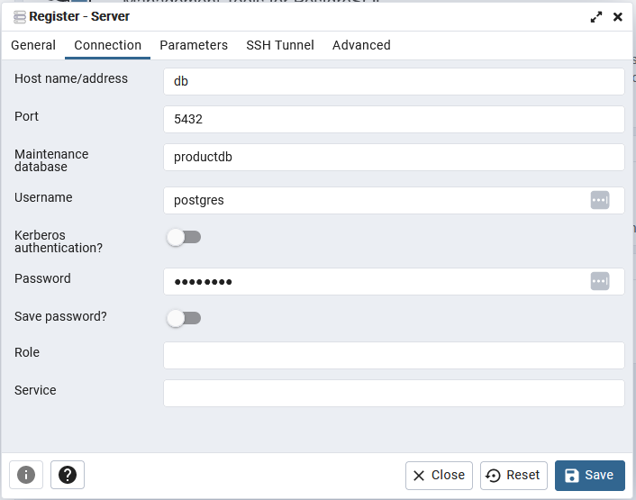

# school-2dv50e-project

## Description

TODO: fill this area


## Instructions

### Database setup


**Step 1 - Run docker compose with postgres & pgAdmin**

  ```pwsh
  docker compose -f ./docker-compose-db-only.yml up -d
  ```

**Step 2 - Login to pgAdmin**

  Goto: http://localhost:5050/

  Username: test@testsson.com
  
  Password: postgres

**Step 3 - Connect to db server**
  Click "Add New Server"
  Name it whatever under "General->Name"
  Goto "Connection" and fill out to match the image below

  

  Click Save.

**Teardown**

  ```pwsh
  docker compose -f ./docker-compose-db-only.yml down --rmi all --volumes
  ```

